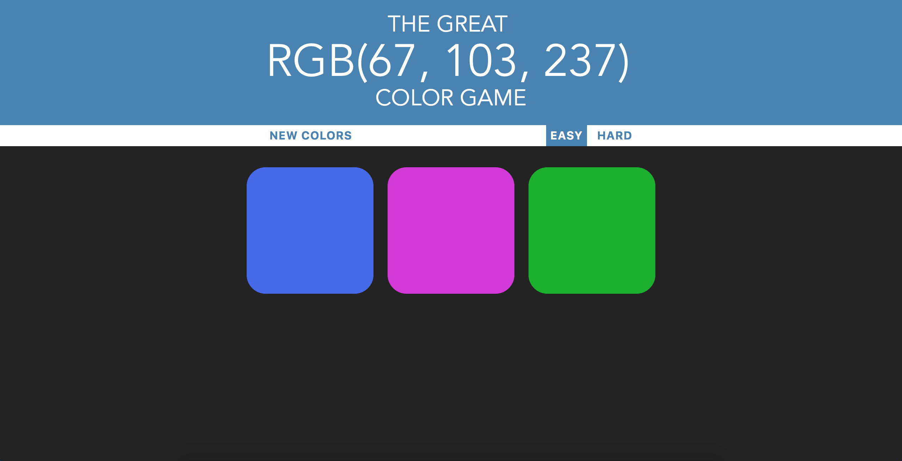

# RGB Color Game

This RGB color game was created with HTML5, CSS3, and JavaScript, as shown in Colt Steele's *The Web Developer Bootcamp* on [Udemy](https://www.udemy.com/).

## How To Play

The game is simple:

The header showcases a color in RGB format

Look at the separate values or red, green, and blue, and evaluate what color, from amongst the ones showcased in the grid, could be the right answer.

Click on the square with your best guess.

If your guess is wrong, the selected square will disappear and you can continue to guess with the remaining squares.

If you guess right, all squares will change color to the correct answer, along with the header.

To play again, simply click on **Play Again?** on the white banner.

### Difficulties

The game opens up automatically on hard mode (six squares).

But easy mode (three squares) is available when clicking **Easy** on the white banner.

The RGB values are not limited to each other so there could be times that the colors are very similar to each other, making the difficulty mode extra hard.

But you can simply click on **New Colors** to get a redraw.

### Future Versions

This application was developped as part of a web developing class, but I am hoping to develop it further in the near future.

## Credits

* **The Web Developer Bootcamp** - *Colt Steele* - [Course Link](https://www.udemy.com/course/the-web-developer-bootcamp/)

* *Rosy Arreola* - [Homepage](https://rosyarreola.netlify.com/)

